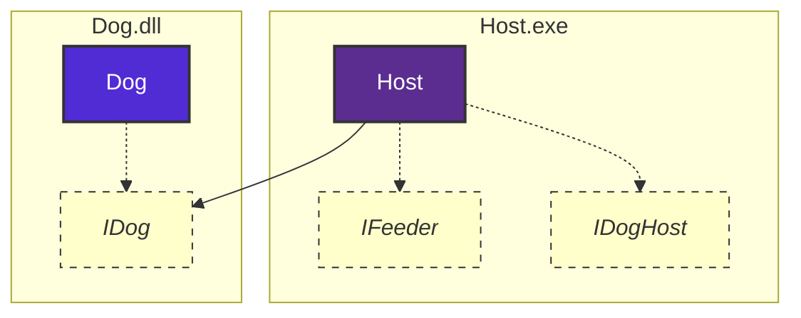

# .NET Components Example


[](LICENSE)

Two components demonstrating .NET component interaction:
- **Dog.dll** – Class library implementing IDog interface
- **Host.exe** – Console app using Dog component

## Architecture


- Dependency Inversion Principle
- **IDog interface** – Defines dog behaviors:
    - *Core:* Bark, Growl, Bite, Run, WagTail
    - *Others:* DemandFood, LiftLeg
- **Dog class** – Implements dog behaviors
- **IFeeder** – *Feeding responsibilities:* GiveFood, GiveDrink, Call
- **IDogHost** – *Care responsibilities:* LeadAnimal, CareForAnimalFur
- **Host** class implements both interfaces
- **Program** – Main entry point with demonstration

## Build & Run
```bash
# Build the solution
dotnet build

# Run the host application
dotnet run --project Host
```
## Attribution
Based on tutorial by Professor V. Giedrimas, Vilnius University *(Šiauliai Academy)*. Extended by:
- Slightly enhanced interface design
- Modern C# language features
